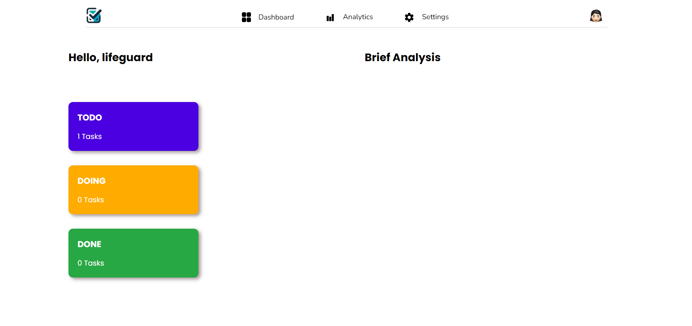
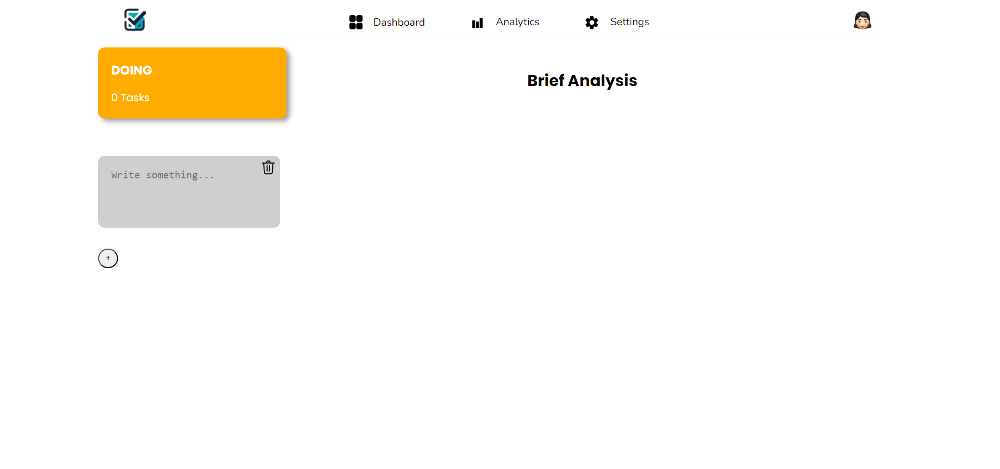

# Todo List App

Todo List App built with Node.js, Express, and SQLite, featuring user authentication and task management.

## Features

- User Registration and Login
- JWT-based Authentication
- Task Management (Add, Edit, Delete tasks)
- User-specific tasks with category filtering (Todo, Doing, Done)

## Prerequisites

- Node.js (v14 or later)
- npm (v6 or later)
- SQLite3

## Installation

1. Clone the repository:
   git clone https://github.com/your-username/todo-list-app.git
   cd todo-list-app

2. Install the dependencies:
   npm install

3. Initialize the SQLite database:
   node dbInit.js

## Running the App

1. Start the server:
   node server.js

2. Open your browser and go to:
   http://localhost:3000

## Project Structure

- `server.js`: Main server file
- `db.js`: SQLite database configuration
- `views/`: HTML files
  - `login.html`: Login page
  - `home.html`: Home page for managing tasks
- `public/`: Static files (CSS, JS, images)
  - `css/`: Stylesheets
  - `js/`: Client-side JavaScript
  - `images/`: Image files

## Usage

- Register a new account
- Login with your credentials
- Add, edit, and delete tasks in different categories (Todo, Doing, Done)
- Tasks are saved to your user account and can be managed across sessions

## Example

